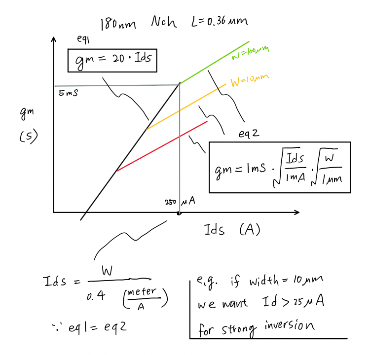

# gm/Id First-Order Estimator

**▶ Open the tool:** [`index.html`](index.html) · **Live:** https://borenw.github.io/gm-id-estimator/

  

> The bench sketch this tool generalizes: a 180 nm NMOS, L = 0.36 µm. Two straight-line asymptotes bound the transconductance, and where they cross is the weak→strong-inversion **corner**.

An interactive, single-file page for the classic back-of-the-envelope question: **for a given drain current, what is gm, and has the device left weak inversion yet?** It plots the two asymptotes live, marks the corner for several device widths, and shows how the underlying constants shift across process nodes.

**▶ Live tool:** https://borenw.github.io/gm-id-estimator/
**📄 Single file:** [`index.html`](index.html) — no build; only dependency is MathJax (CDN) for the formulas. The plots are plain `<canvas>`.

---

## The model

**eq 1 — weak / moderate inversion** (the "gm/Id" limit):

$$g_m = \kappa\, I_d,\qquad \kappa \equiv \left(\frac{g_m}{I_d}\right)_{\max}=\frac{1}{n\,\phi_t}\approx 15\text{–}25\ \text{S/A}$$

Here gm ∝ Id and the slope κ is set by **temperature/physics** (φt = kT/q ≈ 26 mV, subthreshold factor n ≈ 1.2–1.5), essentially **independent of process node**. The sketch uses **κ = 20**.

**eq 2 — strong inversion** (square-law):

$$g_m = \sqrt{2\,\mu_n C_{ox}\,\frac{W}{L}\,I_d}\;=\;1\,\text{mS}\cdot\sqrt{\frac{I_d}{1\,\text{mA}}}\cdot\sqrt{\frac{W}{1\,\mu\text{m}}}$$

Now gm ∝ √Id, and the coefficient carries the **process** through μnCox. Matching the sketch's normalized form at L = 0.36 µm extracts:

$$\mu_n C_{ox}=\frac{(1\,\text{mS})^2\,L}{2}\cdot\frac{1\,\mu\text{m}}{1\,\text{mA}\cdot 1\,\mu\text{m}}\;\Rightarrow\;\mu_n C_{ox}\approx 180\ \mu\text{A/V}^2\quad(\text{180 nm})$$

**The corner** — set eq 1 = eq 2:

$$I_{d,\text{corner}}=\frac{2\,\mu_n C_{ox}}{\kappa^2}\frac{W}{L},\qquad \frac{I_{d,\text{corner}}}{W}=\frac{2\,\mu_n C_{ox}}{\kappa^2 L}$$

With the sketch's numbers this is **2.5 µA/µm** (i.e. `I_d = W/0.4`, W in µm) — reproducing the note *"if W = 10 µm we want Id > 25 µA for strong inversion."* ✔

## Constants vs. process node

Only **one** constant really moves with the node. κ is temperature-limited (≈ 15–25 everywhere); the process story lives in **μnCox** and hence the corner current density. The page ships an **editable** node table (seeded with rough textbook estimates) and redraws the chart and plot as you type your PDK values in.

> ⚠️ **The per-node numbers are order-of-magnitude teaching estimates, not fab data.** Long-channel low-field μnCox depends strongly on L, Vds, back-bias and device flavor (LVT/HVT). For **FinFET/GAA** nodes μnCox loses its plain meaning (drive is quantized per fin) — use the gm/Id lookup-table method with your PDK there. Replace the seed values with your own.

## Files

| file | what |
|------|------|
| [`index.html`](index.html) | the interactive tool (self-contained) |
| `gm_Id.png` | the original hand sketch |

## License

MIT — see [LICENSE](LICENSE).
